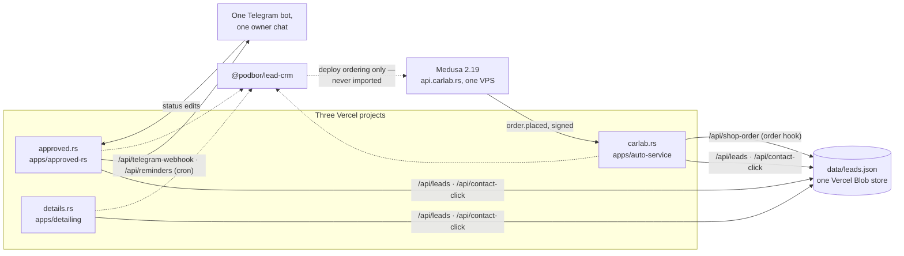
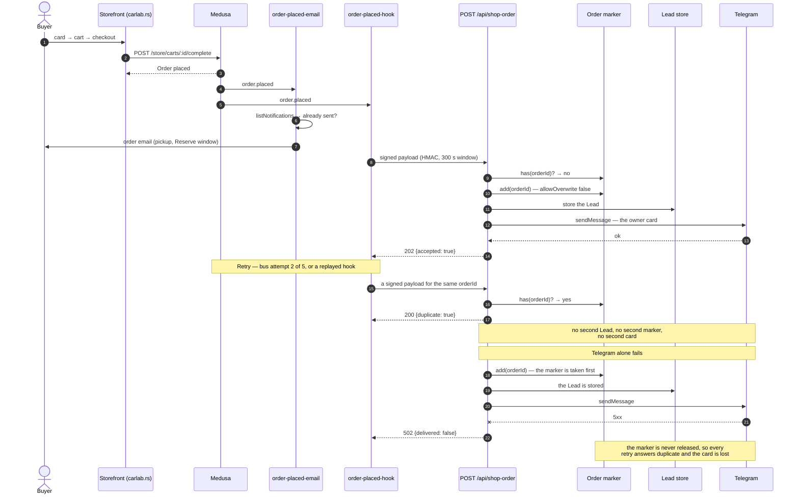

# Testing the shop funnel: four layers, the seams they drive, and what none of them prove

A visitor's path — product card, cart, checkout, Order in Medusa, signed hook,
Lead, owner card in Telegram — crosses four workspaces. Every piece has unit
tests; both bugs found on #84 lived in the seams between them. This document
names every layer, what it asserts, what it costs and what it cannot see, so
that a change is tested at an existing seam instead of cutting a fifth one.

Written after the tests landed (#87, #88, #89), so it describes what is there.

## The four layers, cheapest first

### 1. Lead compatibility — a frozen fixture of every stored Lead shape

|         |                                                                                        |
| ------- | -------------------------------------------------------------------------------------- |
| Seam    | the output of `storedLeadSchema` and `legacyIncomesSchema`, nothing else               |
| File    | `packages/lead-crm/src/storedLeadHistory.test.ts` (fixture and assertions in one file) |
| Command | `pnpm --filter @podbor/lead-crm test`                                                  |
| Cost    | seconds, in CI on every push, under the package's 100% coverage gate                   |

Fifteen historical stored shapes — v0 onward, including the field generations
since retired and a commission rate over 100% written before the cap landed.
Each is read as a Lead and as the legacy money the ledger's opening carries
over. The
assertion is that a Lead one
version wrote is still readable by the version deploying now, because the deploy
filter ships a changed `@podbor/lead-crm` to all three sites at once and a
schema change that orphans stored Leads would otherwise reach production green.

It is the shared catalog package's contract test pointed at stored records
rather than at constants. It asserts what the system reads back, never how the
schema is built.

Two things it establishes that are worth not relearning:

- **No stored shape fails the read.** The Lead schema no longer carries money
  (ADR-0032), and the Lead store never reads the retired income fields. Only
  the ledger's opening does: while `data/ledger.json` does not exist,
  `legacyOwed` in `legacyIncomes.ts` takes every income times its Lead's
  stored rate, less what was confirmed paid, from the raw `data/leads.json`,
  totalled across all Leads, rounded to the cent once and never below zero.
  Money stored without a rate is priced at the former default of 10%, and a
  rate over 100% is priced as stored, not left out. The ledger opens with one
  Payout, `Перенос со старой системы`, for that sum — none when it is zero —
  and no cap on a typed amount applies to it. A record whose money does not
  parse at all is left out of the sum and logged, never dropped quietly.
- **Retired fields are dropped on read, and so on the next write.**
  `baseStoredLeadSchema` is not `.strict()`, so `lastRemindedAt` (v0–v3),
  `customerPaidAt` and the old money fields (`dealAmount`, `commissionPercent`,
  `paidAmount`, `payments`, `incomes`, `pendingCommissionClaim`) are discarded
  by every read, and `store.ts` re-serialises parsed Leads on every write — the
  first mutation erases them from the blob permanently. The money is not lost:
  the Lead store's `beforeWrite` hook (`ledgerStore.ensureOpened()`, wired in
  `brandStore.ts`) writes the ledger blob with its opening Payout before any
  Lead write goes out.

**What it cannot prove.** Version skew between deployed sites. Two sites on
different package versions each pass their own copy of this suite; nothing here
compares them. The hand-walk checklist below is the only check for that, which
is why a green run is not a reason to stop walking the forms.

### 2. Reserve window — the release job against a real database

|         |                                                                                                                                |
| ------- | ------------------------------------------------------------------------------------------------------------------------------ |
| Seam    | `releaseUncollected(container)`, the job's existing default export                                                             |
| File    | `apps/medusa/integration-tests/http/release-uncollected.spec.ts`                                                               |
| Command | `docker compose -f apps/medusa/docker-compose.test.yml up -d --wait` then `pnpm --filter @podbor/medusa test:integration:http` |
| Cost    | ~25–30 s plus the container stack the integration job already stands up                                                        |

The unit spec can show an aged Order being cancelled but structurally cannot
show an Order _inside_ the window surviving: the query does the filtering and a
mocked query returns whatever the test hands it. `cancelOrderWorkflow` does not
come back, so the untested half was the dangerous one. The shape of what it
hands back is no longer free: `selectAll` parses every row against the read's
schema, logs a row that misfits as `Uncollected order skipped: …` and leaves
that Order alone while the rest are released, and `apps/medusa/src/lib/__tests__/reads.unit.spec.ts` holds each
read's schema against a row shaped the way `query.graph` returns it. The
filtering is still only provable here.

Four real Orders are placed through the full store checkout chain on
`bosch-s4-024`:

| Order         | Arranged                                         | Expected   |
| ------------- | ------------------------------------------------ | ---------- |
| `uncollected` | backdated past the window                        | `canceled` |
| `inWindow`    | nothing                                          | `pending`  |
| `paid`        | `capturePaymentWorkflow`, then backdated         | `pending`  |
| `fulfilled`   | `createOrderFulfillmentWorkflow`, then backdated | `pending`  |

Backdating is raw SQL through `dbConnection` (`update "order" set created_at =
now() - interval …`) — the first spec in the repo to reach for it. There is no
workflow or module-service path to move `created_at` (the ORM sets it
`onCreate`), and fake timers hang a suite running a live server, a Redis bus and
workflow polling. Everything is one `it` because `dbUtils.snapshot()` is taken
after `beforeAll` and restored before each subsequent test.

It asserts an id→status map in one `toEqual`, plus the reservation itself: taken
before the act, gone afterwards for the cancelled Order, still held for the
in-window one. So the layer proves the business outcome — stock returned — and
not only the status flip. Line-item ids are captured before the act, because an
empty list afterwards would otherwise pass for the wrong reason.

The window filter is proven by construction: `uncollected` and `inWindow` are
byte-identical Orders placed seconds apart. The log read `1 order(s) cancelled`
with no `refused cancellation` line, so `paid` and `fulfilled` were skipped by
`isUncollected` itself rather than by a swallowed throw.

**What it cannot prove.**

- **Nothing about the cron.** `config.schedule = '0 * * * *'` stays a unit
  assertion; the scheduler wiring is never exercised.
- **Nothing about the boundary.** `RESERVE_DAYS + 1` and "now" sit comfortably
  either side, so an off-by-one in the cutoff arithmetic (hours versus days,
  `$lt` versus `$lte`) survives this layer.
- **Nothing about scale.** Four Orders, so `selectAll`'s `QUERY_PAGE = 200`
  paging loop never takes a second page.
- **The unreadable-amount path stays mocked.** `moneyField` refusing a row is
  reachable only from a corrupt `captured_amount`, which the real database will not store,
  so `113b3bc`'s per-Order survival remains a unit assertion.
- **Inventory arithmetic.** The assertion is scoped to those two Orders' own
  line items, so a cancellation that removed the reservation without crediting
  `stocked_quantity` back would still pass. Asserting the level needs the
  inventory item and location ids — a bigger reach into the seed than this layer
  earns.

### 3. Funnel walk — a browser against a real storefront and a real Medusa

|         |                                                                                                                     |
| ------- | ------------------------------------------------------------------------------------------------------------------- |
| Seam    | the one new one: a browser driving the storefront, with Telegram intercepted at the network boundary                |
| Files   | `apps/auto-service/playwright.config.ts`, `funnel/telegramStub.ts`, `funnel/shopFunnel.spec.ts`, `funnel/README.md` |
| Command | `pnpm --filter @podbor/auto-service funnel` — prerequisites in `funnel/README.md`                                   |
| Cost    | ~15 s of test time on top of the whole backend; **local only, never a CI job**                                      |

Two tests. One Order leaves exactly one Lead, exactly one Order marker and
exactly one `sendMessage` to the group, asserted against the owner card's
payload and the stored Lead's fields. Then, with the fail switch on, a refused
card: the Lead is still stored, the marker is still held, and a second signed
hook for the same Order answers `200 {duplicate: true}` — no second Lead, no
second marker, no second card.

The observation points are files, not seams: the development filesystem Lead
store, the Order marker directory and the intercepted-call log under
`.local-data/`. The walk reads what the system wrote and never reaches into the
handler. That is what makes the filesystem storage adapter load-bearing for
testing rather than only for manual development.

Telegram is intercepted rather than injected as a fake notifier, so the real
notify path runs and a delivery failure can be forced. `@playwright/test` is
pinned at `1.63.0` in `apps/auto-service` devDependencies only; browser binaries
are never installed in CI, because CI's only involvement is `astro check`, which
typechecks `funnel/*.spec.ts` along with the rest of the app.

No dependency-injection seam was added to the order hook route.
`createShopOrderHandler` is already the seam; a second one would be a seam cut
for no new observation.

**What it cannot prove.**

- **Nothing, after the fact.** Local-only by decision, so it gives no regression
  protection. The automated floor for exactly-once is
  `apps/auto-service/src/lib/shopOrder.test.ts` — the handler factory's own unit
  tests, which assert the duplicate answer against a fake marker store. Layer 2
  is the floor for the Reserve window, not for exactly-once; no layer here
  raises exactly-once to a real Order in CI, and that is the gap the walk fills
  by hand.
- **Medusa's own event-bus retry is not what the walk observes.** The 502 does
  make the bus retry, but in every run the retries arrived after Playwright had
  stopped the dev server, so Medusa logs `fetch failed`. The duplicate path is
  exercised by the walk **replaying a signed hook for the same `orderId`** —
  identical at the network boundary and deterministic. A walk therefore leaves a
  short retry storm of `fetch failed` in the Medusa log.
- **The 502 itself is unobserved**, only its cause (the refused Telegram call)
  and its consequences (Lead stored, marker held, `telegramMessageId: null`).
  The response goes to Medusa.
- **A moved button.** The typecheck catches a renamed import; a changed selector
  or a relocated control does not break the build, only the next walk.
- `ru` only, one battery, quantity 1, no installation service,
  `pp_system_default`.

Two Astro 7 facts the harness depends on, both load-bearing: `astro dev`
daemonizes itself when `am-i-vibing` detects an agent environment, which
Playwright reads as "webServer exited early" — `ASTRO_DEV_BACKGROUND=1` is the
only switch that forces the foreground; and `astro dev` takes a lock per root,
so the walk cannot run beside a `pnpm dev`. The latter is deliberate: reusing a
server started without the stub would send cards to the real chat.

### 4. Standing checklists — the hazards no fixture can see

Three lists, below. They cost a person's time, which is why they are last and
why each item says what it is for.

## The seams, listed

A later change tests at one of these rather than cutting a new one.

| Seam                                                           | Layer    | Shape                                                                                     |
| -------------------------------------------------------------- | -------- | ----------------------------------------------------------------------------------------- |
| `storedLeadSchema` / `legacyIncomesSchema` output              | 1        | pure schemas, parse a stored record with each                                             |
| `releaseUncollected(container)`                                | 2        | the job's default export, driven through the Medusa integration runner                    |
| `createShopOrderHandler({ secret, notifyLead, markers, now })` | unit + 3 | already injectable; the route is thin wiring over it                                      |
| `createFormatter({ serviceLabel, botUsername })`               | unit     | the owner card's text                                                                     |
| `LeadStorage`                                                  | 1, 3     | Blob in production, filesystem in development; the walk reads the filesystem one's output |
| `globalThis.fetch` in the dev server's process                 | 3        | where Telegram is intercepted (`funnel/telegramStub.ts`)                                  |

Observation points that are not seams, because nothing is substituted:
`.local-data/data/leads.json`, `.local-data/shop-orders/<id>.json`,
`.local-data/funnel/telegram.jsonl`.

## What is deliberately not tested

Decisions on the record, not oversights.

- **The funnel walk in CI.** The stack is heavy and the value was judged not to
  justify a CI service. Revisit if the walk starts catching real breakage when
  people remember to run it.
- **A dry-run mode for the release job.** An environment variable for the
  Reserve window was already declined once; a second switch for the same job
  would contradict that. The rehearsal below covers the first run instead.
- **The lost owner card when Telegram alone fails.** The Lead is stored, the
  Order marker is held, every retry answers as a duplicate, and the card is
  never re-delivered. Recorded as a consequence in
  [ADR-0022](../adr/0022-orders-reach-the-bot-through-a-signed-hook.md) and as a
  `TODO:` in `apps/auto-service/src/lib/shopOrder.ts`; the fix needs a
  three-state result from the notify path plus a card-only retry, which touches
  all three Brands' routes.
- **Filesystem Lead storage on the other two Brand sites.** Folding the
  development branch away needs the build-time flag at each site, so sharing it
  would mean three copies of the same selector. One copy until a second site
  needs a local walk.
- **Cross-Brand journeys in the browser harness.** The partner block on
  approved.rs opening a CarLab or Details form is a real flow and a plausible
  second harness; it is not this one.
- **Coverage gates for the apps.** Every shared package enforces full coverage;
  no app does. Changing that is its own decision.
- **The email layer.** Order email content is unit-tested and lands in the local
  notification log; a real inbox is tracked separately.
- **The Reserve window's fixture stock has zero margin.** Battery stock for
  `bosch-s4-024` is exactly 4 and layer 2 places exactly 4 Orders. Lower that
  fixture stock, or add a fifth Order, and the spec fails on inventory rather
  than on the Reserve window. Recorded rather than fixed.
- **The owner card's label for a slug no app offers.** `parts-order` is not in
  any app's `SERVICE_SLUGS` on purpose — nothing should offer a shop order as a
  choosable service — so the Brand sites' formatters fall back to
  `@podbor/brands`'s `serviceLabel` for it. There are four copies of the
  service-slug list and no test can span them; AGENTS.md's warning stands.

## Diagrams

Diagrams live beside the prose that needs them, as fenced ` ```mermaid ` blocks
in Markdown: GitHub renders them natively, they diff as text, and they add no
dependency. These two are the repository's first; follow the convention rather
than adding a renderer.

### System design — the asymmetry is the content

The three Brand sites do not ship the same routes. All three write one Lead
store and notify one chat. Medusa does not import `@podbor/lead-crm` at all; it
is in the blast radius only through deploy ordering.



| Route                                 | Approved | Details | CarLab  |
| ------------------------------------- | -------- | ------- | ------- |
| Lead form (`/api/leads`)              | yes      | yes     | yes     |
| Contact click (`/api/contact-click`)  | yes      | yes     | yes     |
| Order hook (`/api/shop-order`)        | no       | no      | **yes** |
| Bot webhook (`/api/telegram-webhook`) | **yes**  | no      | no      |
| Reminders cron (`/api/reminders`)     | **yes**  | no      | no      |

Verified against `apps/*/src/pages/api/`. Approved.rs also ships
`/api/admin/case-photos-*`, which is not part of the shop funnel and is left off
the diagram. Why the asymmetry exists: Telegram allows one webhook URL per bot
([ADR-0014](../adr/0014-bot-webhook-and-cron-hosted-by-approved-rs.md)), the
Leads share one Blob file
([ADR-0004](../adr/0004-leads-in-one-vercel-blob-json-file.md)) and are
separated by the Lead's `brand` field
([ADR-0003](../adr/0003-one-bot-one-lead-store-brand-field.md)).

### How one Order travels, retries included



`EM` and `HK` are Medusa's two `order.placed` subscribers. The Order marker is
`shop-orders/<orderId>.json`, written with `allowOverwrite: false`; the Lead
store is `data/leads.json`.

The marker is taken **before** the Lead is stored and never given back; that is
what keeps a retried delivery from storing a second Lead, and what costs the
card its redelivery
([ADR-0022](../adr/0022-orders-reach-the-bot-through-a-signed-hook.md)). The
email subscriber is independent and deduped against earlier notifications, so
its own retry never emails the buyer twice.

## Checklist: the three Lead forms, by hand

Walk this whenever `@podbor/lead-crm` changes. Layer 1 catches a schema change
that orphans stored Leads; it cannot see version skew between deployed sites,
because both versions pass their own suite. This walk is the only check for it.

- [ ] approved.rs: submit the inline form, the modal and the contact page form —
      three renderings per page, nested labels, so a duplicate-id regression
      shows up as the wrong form being focused.
- [ ] details.rs: the same three, plus one work page (the service arrives from
      `servicesApplied[0]`).
- [ ] carlab.rs: the same three, plus one service page (hidden `SERVICE_FIELD`).
- [ ] One contact click per site, so the `Клик: <канал>` card line is exercised.
- [ ] A lead with no service, so the owner card renders `—` and the
      `Страница:` line carries the visited page.
- [ ] One partner-block lead from approved.rs into each sister Brand, and check
      the stored `brand` is the sister's.
- [ ] Each owner card arrives with a readable service label, not a raw slug.
- [ ] After the first card, press one status button so the bot re-renders the
      card from the stored Lead — that read is the one layer 1 pins.
- [ ] A non-Russian locale on at least one site, so the hidden `locale` field is
      exercised and the lead does not land on `/ru/thanks/`.
- [ ] Check `data/leads-unreadable.json` is not growing. A new entry means one
      site is writing what another cannot parse — the half-deployed-package
      failure.

Deploy order matters while this is walked: all three sites must be on the same
`@podbor/lead-crm`. The `turbo --filter="...[<deployed tag>]"` filter in
`ci.yml` arranges that; do not narrow it.

## Checklist: rehearsal before the release job first runs on real Orders

Cancelling an Order is the one irreversible action in the system. It must not
also be its first. Do this on the production VPS, before the hourly job is
allowed to find anything.

- [ ] Layer 2 green on the deploying image's commit.
- [ ] Confirm the Reserve window in `RESERVE_DAYS` matches the owner's answer
      (3 days, #68) and matches what the order email tells the buyer.
- [ ] Place one Order by hand in production and backdate its `created_at` past
      the window, in the database, on that Order only.
- [ ] Place a second Order and leave it alone.
- [ ] Let the next hourly tick run it. `release-uncollected` is a scheduled job,
      not a script, so `medusa exec` cannot drive it — its default export takes
      the container, not `{ container }`. Watch the container log instead of
      inventing a hand-run path.
- [ ] Read the log: exactly `Uncollected orders: 1 of 1 cancelled`, and no
      `refused cancellation` or `Uncollected order skipped` line.
- [ ] In the admin: the aged Order is `canceled`, the second is untouched, and
      the aged Order's stock is back on the shelf.
- [ ] Cancel the second Order by hand afterwards, so the rehearsal leaves no
      stock reserved.
- [ ] Only then let the cron run.

If the first real cancellation is wrong, there is no undo — the fix is to
restore the reservation by hand and place the Order again.

## Checklist: pre-flight for the shop going live

Moving `SHOP_STATUS` from `off` is a decision, not a leap
([ADR-0025](../adr/0025-shop-status-and-dev-preview.md)). Each item says whether
CI covers it or a person must do it. The owner-side blockers are tracked in
[open-questions.md](open-questions.md#launching-the-carlab-shop); this list is
the technical gate.

|     | Check                                                                                                                                                                                              | Who                                                    |
| --- | -------------------------------------------------------------------------------------------------------------------------------------------------------------------------------------------------- | ------------------------------------------------------ |
| 1   | Layer 1 green — stored Leads still parse under all three Brands                                                                                                                                    | automated (CI)                                         |
| 2   | Layer 2 green — the Reserve window cancels only aged, unpaid, unfulfilled Orders                                                                                                                   | automated (CI)                                         |
| 3   | `astro check` green, funnel specs included                                                                                                                                                         | automated (CI)                                         |
| 4   | Layer 3 walked once against the release candidate                                                                                                                                                  | **person**, local                                      |
| 5   | The rehearsal above, on production                                                                                                                                                                 | **person**                                             |
| 6   | VPS up, compose stack healthy, Caddy the single hop in front of Medusa                                                                                                                             | automated by `medusa-image`, confirmed by a **person** |
| 7   | `SHOP_ORDER_HOOK_SECRET` identical on the VPS and in the carlab.rs project, ≥32 chars                                                                                                              | **person**                                             |
| 8   | `ADMIN_URL` is https — `orderHookSchema` refuses anything else                                                                                                                                     | automated (the schema), but set by a **person**        |
| 9   | Brevo keys present with DKIM, so the order email is not the local notification provider                                                                                                            | **person** (#70)                                       |
| 10  | `TELEGRAM_GROUP_ID`, `TELEGRAM_OWNER_ID` and `TELEGRAM_ADMIN_ID` filled on the carlab.rs project — without the admin id the quarantine is silent                                                   | **person**                                             |
| 11  | Real prices and stock typed into the Medusa admin, under 10 SKUs, batteries only at launch (#68)                                                                                                   | **person**                                             |
| 12  | Fitment entries spelled consistently — checked for shape only, against no dictionary ([ADR-0028](../adr/0028-no-vehicle-dictionary-until-fitment-is-required.md))                                  | **person**                                             |
| 13  | The shop's legal pages, with the seller's poslovno ime, PIB, matični broj and seat (#76, #79)                                                                                                      | **person**                                             |
| 14  | The three shop funnel goals (`add_to_cart`, `begin_checkout`, `order_placed`) created in the carlab.rs Metrika counter — an event fired in code but absent from the counter is lost silently (#72) | **person**                                             |
| 15  | Serbian and English shop copy filled by the translate job, then read once by a person                                                                                                              | automated, then **person**                             |
| 16  | `catalog-version.txt` and `GET /store/catalog-version` agree, so a catalog write rebuilds the static storefront ([ADR-0020](../adr/0020-static-storefront-rebuilt-on-catalog-version.md))          | automated (CI scope step)                              |
| 17  | One real order placed end to end on `preview`, cancelled by hand afterwards — preview orders are real orders marked `metadata.preview: true`                                                       | **person**                                             |
| 18  | `SHOP_STATUS` flipped to `live`, then one page checked for `noindex` being gone                                                                                                                    | **person**                                             |

Nothing in rows 4, 5, 7 and 11–14 has an automated equivalent, and no CI run
will say they were skipped.

## Adding to this

Pick an existing layer. A new assertion about stored Lead shapes is a fixture
row in layer 1; a new assertion about the release job is an arranged Order in
layer 2; a new assertion about the buyer's path is a step in layer 3. A fifth
layer needs a seam none of the six above can reach — say which, here, before
cutting it.
